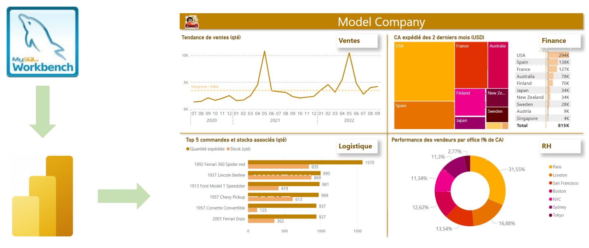

# :car: Dashboard Model Company

Student Project using :
 - MySQL Workbench for SQL requests
 - PowerBI for the dashboard

## :ledger: Index

 - [Subject](https://github.com/AlexCNZRZ/Dashboard-Model-Company/edit/main/README.md#beginner-subject)
 - [Product Backlogs](https://github.com/AlexCNZRZ/Dashboard-Model-Company/edit/main/README.md#dart-product-backlogs)
 - [Workflow diagram](https://github.com/AlexCNZRZ/Dashboard-Model-Company/edit/main/README.md#wrench-tools)
 - [Steps of the project](https://github.com/AlexCNZRZ/Dashboard-Model-Company/edit/main/README.md#scroll-steps-of-the-project)
 - [Gallery](https://github.com/AlexCNZRZ/Dashboard-Model-Company/edit/main/README.md#camera-gallery)
 - [Team members](https://github.com/AlexCNZRZ/Dashboard-Model-Company/edit/main/README.md#handshake-team-members)

## :beginner: Subject

We were commissioned by a fictitious company selling models and scale models.
The company already has a database that lists employees, products, orders and much more.
The director wishes to have a dashboard which he could refresh daily to have the latest information in order to manage the company.

## :dart: Product Backlogs

The dashboard revolves around these 4 main topics : 
- **Sales** : number of products sold by category and by month, compared to the sales of the same month of the previous year.
- **Finances** : turnover of the orders of the last two months by country and orders that have not yet been paid.
- **Logistics** : stocks of the products that need to be supplied.
- **Human Resources** : Each month, the two sellers with the highest turnover.

## :twisted_rightwards_arrows: Workflow diagram

## :scroll: Steps of the project

- Connection to the database and creation of a local one from it
- Checking the integrity of the data in the database
- Printing a modelisation of the database
- Writing the SQL queries for each product backlogs
- Implementing queries in PowerBI
- Consolidation of the dashboard with all the queries by product backlogs

## :camera: Gallery

 - screenshot of the modelisation of the database
 - screenshot of the dashboard synthese

## :handshake: Team members

- [Aurélien GAZENGEL](https://github.com/Aurelien-GZL)
- [Anthony ETIENNE](https://github.com/Anthowheels)
- [Alexandre CANIZAREZ](https://github.com/AlexCNZRZ)

## :lock: License

Add a license here, or a link to it.

[![forthebadge()]](https://forthebadge.com)
